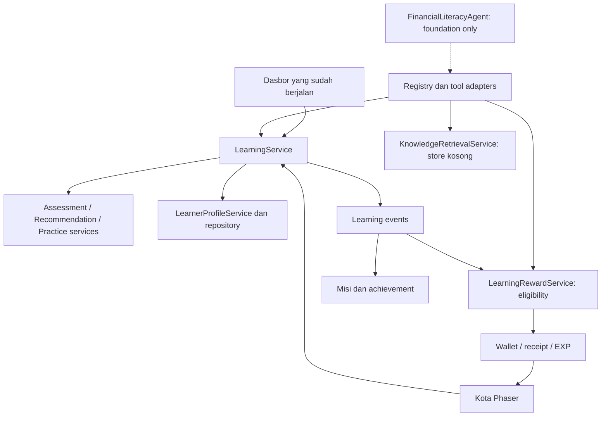

# After Gamifikasi — Edukasi Literasi Keuangan

Website Tugas Akhir untuk asesmen, pembelajaran adaptif, latihan skenario,
asesmen ulang, dan perkembangan kota. Pencatatan transaksi pribadi/PFM sudah
dilepas dari aplikasi.

## Menjalankan

Gunakan Node.js 22.19+ atau 24+. Salin `.env.example` ke `.env.local` dan isi
konfigurasi aplikasi web Firebase.

```sh
npm install
npm run dev
npm run typecheck
npm run lint
npm test
npm run build
```

`.env.local` diabaikan Git. Konfigurasi web Firebase bukan credential server;
jangan menaruh kunci LLM/service-account dalam variabel `VITE_*`.
Authentication tetap memakai Firebase. Rules lokal belum di-deploy.

## Akses pengujian lokal

Saat `npm run dev` dibuka melalui `localhost`, `127.0.0.1`, atau loopback IPv6,
halaman `/` menampilkan empat tombol:

- **Masuk Admin Lokal**: langsung ke game dengan Kontrol Admin.
- **Coba User Lokal**: langsung ke game sebagai pengguna biasa, tanpa alat admin.
- **Tes Login User**: membuka formulir login Firebase.
- **Tes Registrasi User**: membuka formulir registrasi Firebase dan verifikasi email.

Akun lokal tidak membutuhkan email/kata sandi dan tidak membuat akun Firebase.
Admin dan user lokal memakai UID terpisah; progres tersimpan di browser. Sesi uji
bertahan saat reload pada tab yang sama. Klik nama aplikasi untuk kembali memilih
akses; **Keluar** mengakhiri sesi. Memilih tes login/registrasi mengakhiri sesi aktif.
Pengiriman formulir registrasi yang valid membuat akun pada Firebase yang terhubung.

Akses cepat tidak aktif pada `npm run build`/`npm run preview`, termasuk jika ada
penanda sesi lokal lama. Akses melalui alamat LAN juga tidak mengaktifkannya.

## Alur yang tersedia

1. Daftar, verifikasi email, dan masuk.
2. Buka **Belajar**, kerjakan asesmen awal.
3. Ikuti rekomendasi materi berdasarkan kompetensi dan prasyarat.
4. Baca materi, lulus latihan skenario, lalu lulus asesmen ulang (ambang demo 80).
5. Profil, mastery, riwayat, misi, pencapaian, EXP, dan mata uang diperbarui.
6. Tantangan Anggaran membuka Kedai Kopi untuk dibeli. Hadiahnya dapat digunakan
   untuk meningkatkan Bank ke level 2 dan membuka Tantangan Keamanan Digital.
7. Tantangan Keamanan Digital membuka Kantor Polisi. Harga dan syarat kendaraan
   tetap berlaku.

Membaca saja tidak memberi mastery. Hadiah utama sekali per tantangan. Pengulangan
belajar tetap tersedia; soal yang sama tidak dihitung berulang dalam satu hari.
Bonus misi harian terpisah dari hadiah utama. Kapasitas Bank dan inventori berlian
berlaku. Koin pasif kota adalah mekanisme pendukung, bukan sumber mastery/EXP.

## Status implementasi

Ada 7 definisi kompetensi, 2 materi demonstrasi, 2 tantangan, dan 5 paket asesmen.
Skor overall hanya merangkum kompetensi terukur; UI menampilkan cakupannya.

Alur aplikasi saat ini menggunakan layanan deterministik. AssessmentService
menilai jawaban, LearnerProfileService memperbarui mastery berdasarkan evidence,
LearningRecommendationService memilih materi sesuai skor/prasyarat, dan
PracticeService mengevaluasi latihan/asesmen ulang. LearningService menyimpan
hasil dan meneruskan progres ke misi, achievement serta LearningRewardService.

| Kemampuan | Status |
| --- | --- |
| Alur belajar, scoring, mastery, rekomendasi berbasis aturan | IMPLEMENTED |
| Gamifikasi, kota, autentikasi, akses uji lokal | IMPLEMENTED |
| Tool adapters dengan validasi dan eligibility reward | IMPLEMENTED |
| Satu FinancialLiteracyAgent, registry, kontrak provider, bounded runner | FOUNDATION ONLY |
| Knowledge retrieval abstraction/filter verified | FOUNDATION ONLY; knowledge base default EMPTY |
| Integrasi LLM dan pemilihan tool oleh LLM | NOT IMPLEMENTED |
| Semantic retrieval/RAG dan interaksi adaptif dari LLM | NOT IMPLEMENTED |
| Validasi ahli terhadap konten/ambang asesmen | NOT IMPLEMENTED |

Target berikutnya adalah **satu Financial Literacy Agentic AI** yang menggunakan
tools/services tersebut. Runner belum terhubung ke UI atau provider; tanpa
provider, `run()` berhenti dengan status `not-configured`. Tidak ada SDK/API AI,
training, fine-tuning, scraping, atau kutipan rekaan. KnowledgeRepository default
kosong dan hanya mengembalikan sumber verified.

## Struktur

```text
src/
  learning/
    competencies/   # Definisi kompetensi dan ambang mastery
    assessment/     # Soal, jawaban, hasil dan evidence
    modules/        # Model dan katalog demonstrasi
    challenges/     # Skenario, prasyarat, hasil practice
    progress/       # Profil, riwayat, event dan hook
  agent/
    FinancialLiteracyAgent.ts # Satu runner terbatas; belum ada provider aktif
    types.ts                 # Goal/context/action/observation/tool I/O
    provider.ts              # Kontrak netral untuk backend model di masa depan
    toolRegistry.ts          # Allowlist, schema, validasi, eksekusi tool
    learningTools.ts         # Adapter layanan; UID/submission dari aplikasi
  gamification/
    missions/
    achievements/
    rewards/
    octalysis/
  game/
    city/           # Penyimpanan per UID dan unlock learning
    GameScene.ts    # Mesin Phaser dipertahankan di lokasi asal
    ...             # Kamera, kendaraan, bangunan, toko, events
  services/
    assessment/     # Scoring deterministik
    recommendation/ # Rekomendasi berbasis aturan
    practice/       # Evaluasi latihan dan asesmen ulang
    learnerProfile/ # Akses profil dan transformasi mastery
    learning/       # Orkestrasi alur belajar dan kontrak layanan
    persistence/    # Repository + adapter lokal
    knowledge/      # Kontrak sumber kurasi/RAG
    admin/          # Kontrak draft/publish konten
    userProfile.ts  # Profil Firestore untuk auth
  components/learning/
```



Agent tidak menerima tool penulisan skor, currency, database, atau profil mentah.
Tool jawaban menerima ID submission pengguna yang disediakan aplikasi, bukan
jawaban buatan model. Jumlah reward berasal dari konfigurasi. UID diikat oleh
aplikasi saat registry dibuat; ini belum menggantikan autentikasi/otorisasi server.

Lihat [laporan arsitektur single-agent](docs/single-agent-refactor-report.md) untuk
daftar tool, batas tanggung jawab, hasil tes, dan risiko integrasi backend.

## Penyimpanan

Profil akun tetap di Firestore `users/{uid}`. Data belajar, asesmen, mastery,
misi, lencana, mata uang dan tata kota masih localStorage per UID. Belum tersedia
sinkronisasi lintas perangkat atau ledger reward otoritatif di server.

Data PFM/kota global lama tidak dihapus. Kota global **tidak otomatis dipindahkan
ke akun** karena pemiliknya tidak diketahui; akun memakai layout per UID baru.
Stat/inventori yang sebelumnya sudah per UID dipertahankan. Bukti transaksi lama
tidak dikonversi menjadi mastery. Lihat [laporan refactor](docs/refactor-report.md)
dan [audit dependensi](docs/refactor-audit.md).

## Pengujian

`npm test` menjalankan tes autentikasi pendukung dan unit/integrasi learning lokal.
Tidak menghubungi Firebase production. Loader tes menangani import TypeScript
dan URL gambar.

Tes fondasi agen memakai provider terskrip **hanya di tests/** untuk memeriksa
allowlist, input invalid, loop terbatas, timeout, pembatalan dan observasi hasil.
Fixture save dari implementasi sebelum refactor memeriksa kompatibilitas tanpa
mengubah kunci localStorage, schemaVersion 1, atau nilai evaluator `rules-demo`.

Tes browser opsional: `node tests/browser-learning-smoke.mjs`, dengan Vite pada
`http://127.0.0.1:5176`. Memerlukan Chrome dan playwright-core yang sudah tersedia
di lingkungan lokal; tidak ditambahkan sebagai dependensi aplikasi. Akun
diintersepsi di browser tes tanpa mengganti source autentikasi.

Skrip lama `tests/e2e-auth-flow.mjs` menyentuh Firebase production. Skrip tersebut
tidak dimasukkan ke npm test dan tidak dijalankan pada refactor ini.

Tes akses lokal: jalankan dev pada port 5176, `npm run build`, lalu
`npm run preview -- --host 127.0.0.1 --port 4176` dan
`node tests/browser-local-access-smoke.mjs`. Tes mencakup admin/user lokal,
pergantian sesi, formulir/validasi, dan penolakan sesi lokal pada build produksi;
tidak mengirim kredensial valid atau membuat akun Firebase.
