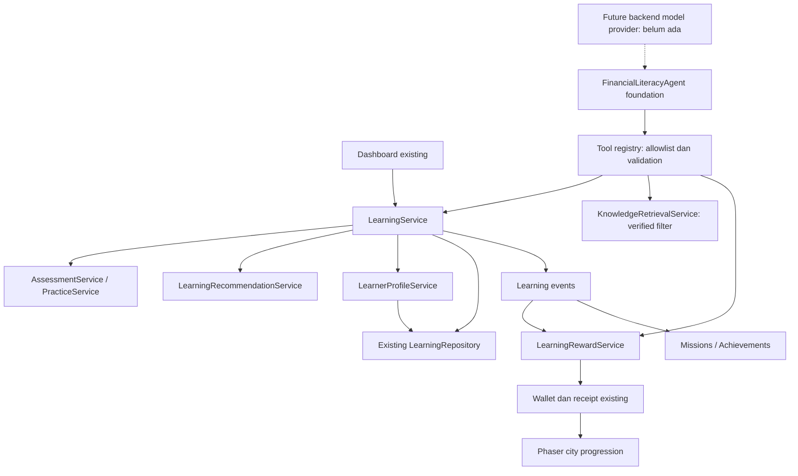

# Laporan refactor fondasi satu Financial Literacy Agent

Tanggal: 30 September 2026. Status aplikasi: **deterministic financial literacy
learning system + single-agent architecture foundation**. Integrasi LLM belum ada.

## 1. Architecture before

Dashboard memanggil LearningService yang mengoordinasikan tiga objek dengan nama
AssessmentAgent, MentorAgent dan PracticeAgent. Implementasinya sebenarnya berupa
scorer berbobot, rekomendasi berdasarkan aturan, dan evaluator latihan. Tidak ada
model, pemilihan tool, atau keputusan AI. Assessment juga memuat transformasi
mastery; defaultLearningService langsung mengirim konfigurasi hadiah ke wallet.

Audit sebelum perubahan tersedia di [single-agent-audit.md](single-agent-audit.md)
dan [snapshot 114 source/test files](single-agent-audit-before.json). Seluruh
26 tes baseline lulus. [Snapshot setelah refactor](single-agent-audit-after.json)
memuat 124 source/test files, termasuk fixture kompatibilitas. Fixture save sintetis dibuat dengan implementasi lama
sebelum pemindahan kode. Data pengguna asli tidak dibaca atau dimigrasikan.

## 2. Architecture after

UI existing tetap memakai LearningService. Domain services menangani aturan
objektif. Fondasi FinancialLiteracyAgent bersifat opsional dan memakai registry
adapter untuk mengakses layanan yang sama; tidak ada salinan state belajar.

LearningService tetap menjadi satu tempat untuk menyimpan hasil dan menerbitkan
event. LearnerProfileService membaca repository yang sama, menyediakan skor,
history dan jalur materi, serta melakukan transformasi profil tanpa menulis state
duplikat. Jalur materi mengacu prasyarat materi; gate kota untuk challenge tetap
divalidasi oleh LearningService.

## 3. Renamed / moved

| Old | New | Reason |
| --- | --- | --- |
| `src/agents/assessment/ruleBasedAssessmentAgent.ts` | `src/services/assessment/assessmentService.ts` | Penilaian jawaban objektif merupakan layanan deterministik |
| `updateLearnerModel` dalam evaluator lama | `src/services/learnerProfile/learnerProfileService.ts` / `updateCompetencyProfile` | Memisahkan perhitungan skor dari transformasi learner model |
| `src/agents/mentor/ruleBasedMentorAgent.ts` | `src/services/recommendation/learningRecommendationService.ts` | Rekomendasi memakai aturan skor/prasyarat |
| `src/agents/practice/ruleBasedPracticeAgent.ts` | `src/services/practice/practiceService.ts` | Evaluasi practice/reassessment memakai scorer yang sama |
| `src/agents/shared/contracts.ts` | `src/services/learning/contracts.ts` | Kontrak layanan domain, bukan kontrak beberapa agen |
| `AgentContext`, `AgentServices`, `MentorRecommendation` lama | `LearningOperationContext`, `LearningDomainServices`, `LearningRecommendation` | Menamai tipe sesuai tanggung jawab sebenarnya |
| Panggilan wallet langsung di integrasi learning | `LearningRewardService.grantLearningReward` | Eligibility diperiksa sebelum wallet menerima reward dari konfigurasi |

Semua import/test aktif telah diperbarui; file implementasi lama di src/agents
dipindahkan, tanpa compatibility alias bernama agen lama. Snapshot audit tetap
memuat nama lama sebagai bukti historis. NPC "Mentor" adalah karakter game.

## 4. Preserved logic

- Scoring berdasarkan jawaban/kunci/bobot; validasi jawaban lengkap, ID unik,
  opsi valid dan bobot. Evidence, feedback, versi soal dan evaluator `rules-demo`
  dipertahankan.
- Mastery dari asesmen awal/ulang; practice dan membaca tidak langsung menaikkan
  mastery. Rumus overall, kompetensi belum diukur dan ambang demo 80 tetap sama.
- Rekomendasi prioritas skor rendah dari materi yang prasyaratnya terpenuhi,
  termasuk penjelasan dasar/penerapan sesuai skor.
- Validasi materi dibaca, practice lulus, serta gate level kota sebelum reassessment.
- Completion, riwayat, misi, achievement, receipt satu kali, kapasitas wallet,
  bonus level, reward dan building unlock tetap bekerja.
- Reuse request ID untuk operasi yang sama tetap idempotent; request ID yang
  dipakai untuk asesmen/challenge/purpose lain sekarang ditolak secara eksplisit.
- Tidak mengubah katalog materi/soal, auth/akses lokal, route, scene, kamera, cuaca,
  placement/collision/undo, shop, vehicles, passive income, tutorial atau assets.
- Mapping Octalysis tetap: CD2/CD3/CD4 implemented, CD6 partial;
  CD1/CD5/CD7/CD8 belum lengkap. Tidak ada mekanik baru untuk mengubah klaim itu.

Kunci penyimpanan, schemaVersion 1, ID materi/tantangan, receipt dan Firestore
tetap sama. Tidak ada migrasi, reset progres, penulisan data produksi atau deploy.

## 5. Single agent foundation

`src/agent/FinancialLiteracyAgent.ts` merupakan satu-satunya runner agen. Ia
menerima goal, registry yang sudah terikat identitas pengguna, dan provider opsional.
`types.ts` mendefinisikan learner context, state, action, observation serta typed
tool I/O; `provider.ts` menyediakan kontrak netral `AgentModelProvider`.

Runner mengobservasi profil, meminta keputusan provider, memvalidasi keputusan,
menjalankan tool yang diizinkan, kemudian membaca ulang state/result. Tidak ada
default provider atau keputusan model palsu. Tanpa provider, status `not-configured`.

Proteksi yang sudah dapat diuji:

- Allowlist eksplisit per tugas; tool tidak dikenal/di luar izin ditolak.
- Input object dengan properti yang diizinkan, tipe string/enum dan batas panjang.
- Default 8 langkah, hard cap 20; batas waktu per langkah default 5 detik, maksimum
  30 detik. Nilai limit invalid ditolak, bukan dianggap tanpa batas.
- AbortSignal untuk pembatalan; eksekusi bersamaan pada instance yang sama ditolak.
- Error provider tidak membocorkan detail internal; tool failure menghentikan tugas.
- Status akhir `completed`, `awaiting-input`, `step-limit`, `failed`, `cancelled`,
  atau `not-configured`. Tidak ada pekerjaan terjadwal setelah status akhir.
- Observasi terstruktur hanya dikembalikan dalam memori. Tidak ada penyimpanan
  chain-of-thought, reasoning log, background worker atau autonomous infinite loop.

Snapshot context memuat skor/progres, 20 history terakhir, jalur materi dan level
kota. Salinan context/specification melindungi state runtime dari mutasi provider.
Runner ini belum dipasang pada UI; alur deterministik existing tetap digunakan.

## 6. Available tools

Semua adapter terdapat di `src/agent/learningTools.ts`. Tool selection oleh LLM
belum tersedia. Status IMPLEMENTED di bawah berarti adapter layanan dapat dieksekusi.

| Tool | Purpose | Underlying service | Deterministic / Future AI-assisted | Status |
| --- | --- | --- | --- | --- |
| getLearnerProfile | Baca skor, progres, history, jalur belajar dan level kota | LearningService / LearnerProfileService / city progress | Deterministic | IMPLEMENTED |
| getLearningRecommendation | Rekomendasi materi sesuai skor/prasyarat | LearningRecommendationService | Deterministic | IMPLEMENTED |
| getLearningModule | Baca materi setelah prasyarat terpenuhi | LearningService + catalog | Deterministic | IMPLEMENTED |
| startAssessment | Sediakan asesmen awal tanpa kunci jawaban | LearningService + catalog | Deterministic | IMPLEMENTED |
| scoreAssessment | Nilai submission pengguna yang telah tersedia | LearningService → AssessmentService → LearnerProfileService | Deterministic | IMPLEMENTED |
| markModuleRead | Simpan progres membaca; tidak memberi mastery | LearningService → LearnerProfileService | Deterministic | IMPLEMENTED |
| startPractice | Sediakan practice atau reassessment setelah gate terpenuhi | LearningService + catalog | Deterministic | IMPLEMENTED |
| evaluatePractice | Evaluasi submission practice/reassessment dan jalankan update alur existing | LearningService → PracticeService / LearnerProfileService | Deterministic | IMPLEMENTED |
| retrieveKnowledge | Filter sumber verified; hasil kosong eksplisit | KnowledgeRetrievalService → KnowledgeRepository | Deterministic local filter; future semantic retrieval | FOUNDATION ONLY |
| checkRewardEligibility | Periksa completion, evidence, konfigurasi dan receipt | LearningRewardService | Deterministic | IMPLEMENTED |
| grantLearningReward | Periksa ulang eligibility lalu grant sesuai konfigurasi/kapasitas | LearningRewardService → wallet existing | Deterministic | IMPLEMENTED |

`startPractice`/`evaluatePractice` memakai purpose `practice` atau `reassessment`;
tidak membutuhkan tool duplikat. Update mastery/progres completion terjadi otomatis
di workflow scoring, bukan tool yang membolehkan model mengisi skor/profil mentah.

Model tidak dapat memasukkan userId, jawaban, score, reward amount atau receipt ID
melalui input tool. UID dan submission jawaban diikat aplikasi saat registry
dibuat. ID submission saja yang diterima evaluator. Tool pertanyaan tidak
menyertakan correctOptionId atau penjelasan kunci sebelum jawaban dikirim.

Reward dihitung dari konfigurasi yang sama. Eligibility memeriksa challenge
dikenal, completion modul/challenge, evidence reassessment lulus milik pengguna,
versi asesmen dan receipt. Wallet tetap menangani kapasitas, bonus level dan
penyimpanan receipt+saldo; pemberian reward tidak mengubah mastery.

## 7. AI status

| Kemampuan | Status | Batas saat ini |
| --- | --- | --- |
| LLM integration | NOT IMPLEMENTED | Tidak ada API/SDK/model provider aktif |
| Tool calling by LLM | NOT IMPLEMENTED | Registry diuji melalui panggilan deterministik dan test fixtures |
| RAG | FOUNDATION ONLY | Abstraction/filter verified tersedia; semantic/vector retrieval NOT IMPLEMENTED |
| Knowledge base | EMPTY | Default tanpa sumber, tanpa scraping/kutipan rekaan |
| Agent loop | FOUNDATION ONLY | Bounded runner tersedia; keputusan LLM belum ada |
| Personalized educational interaction dari LLM | NOT IMPLEMENTED | UI memakai rekomendasi/feedback berbasis aturan |

Knowledge query mendukung competency, topic dan difficulty. Adapter repository
saat ini hanya memfilter metadata competency; topic/difficulty belum menjadi
ranking semantik. Hasil memakai mode `curated-filter-only` dan status
`no-verified-results` jika tidak ada passage. Tidak diklaim sebagai RAG aktif.

| Tanggung jawab sistem deterministik | Tanggung jawab calon agen |
| --- | --- |
| Kunci jawaban, objective scoring, formula mastery | Memilih tindakan pembelajaran dan tool yang diizinkan |
| Prasyarat, auth/authorization, validasi workflow | Menggunakan learner context dan meminta asesmen/practice |
| Eligibility/amount reward, inventory, currency/EXP | Meminta reward yang selanjutnya divalidasi sistem |
| Persistence, game state, building unlock | Meminta knowledge retrieval dan penjelasan personal berbasis sumber |

Calon model tidak menggantikan aturan bisnis/security. Integrasi pretrained LLM
nanti melalui backend; tidak ada secret/API privat di frontend, training, atau
fine-tuning yang ditambahkan pada refactor ini.

## 8. Test results

| Pemeriksaan | Hasil |
| --- | --- |
| Baseline sebelum perubahan | 26/26 lulus |
| TypeScript/typecheck | Lulus |
| Lint | Lulus |
| Unit/integration tests | 46/46 lulus: 26 existing + 20 baru |
| Production build | Lulus; warning bundle besar existing tetap ada |
| Browser learning smoke | Lulus: kedua learning loops, mastery/reward, upgrade Bank, city gate, kendaraan dan reload |
| Browser local access / production guard | Lulus: admin/user lokal, form/validasi, logout/reload, isolasi profil, guard produksi |
| `git diff --check` | Lulus |

Tes baru meliputi registry/allowlist/schema, assessment tanpa kunci, submission
pengguna, practice/reassessment, alur learning ke kota, profil tanpa state
duplikat, reward eligibility/capacity/idempotency, kompatibilitas save lama,
knowledge kosong, provider belum tersedia, observasi hasil, step limit, error,
await-input, timeout, cancellation, concurrent run dan input limit invalid.

Provider terskrip hanya ada di tests. Tidak ada koneksi AI atau akun Firebase
production yang dibuat oleh pengujian ini. Alur autentikasi lengkap dengan email
production serta seluruh variasi placement/collision/undo belum diuji end-to-end.
Browser diuji pada desktop dan mobile 390px; tidak ada JavaScript page error.

## 9. Remaining work

1. Backend dengan verifikasi Firebase token/ownership, server-side scoring,
   storage adapters dan otorisasi tool per tugas. UID argumen lokal belum bukti auth.
2. Adapter pretrained LLM pada backend dengan structured tool calling dan output
   validation; evaluasi keputusan, biaya, timeout, retry dan rate limit.
3. Kurasi/verifikasi sumber, semantic retrieval serta evaluasi kualitas citation.
4. UI percakapan/adaptive interaction yang meminta input pengguna ketika perlu;
   kirim submission autentik ke workflow, bukan jawaban buatan model.
5. Kebijakan prompt injection, data minimization dan output safety. Konten sumber
   adalah referensi tak tepercaya, bukan instruksi yang mengubah allowlist.
6. Validasi ahli terhadap materi/soal dan threshold 80, serta evaluasi penelitian.

## 10. Risks

- **Architecture:** domain services masih sinkron sesuai implementasi existing.
  Adapter jaringan/persistence server nantinya perlu async contracts. Allowlist
  teknis perlu dilengkapi kebijakan per tujuan dan tindakan pengguna.
- **Persistence:** localStorage bisa dimodifikasi, terhapus, atau berkonflik
  antartab. Profil dan wallet belum satu transaksi. Reconcile completion tetap
  memakai receipt existing; perlu ledger/server transaction untuk produksi.
- **Security:** UID/submission yang diikat registry berasal dari aplikasi;
  aplikasi browser belum menjadi trusted boundary. Admin existing masih email
  whitelist di klien. Kunci soal tetap ada di bundle katalog existing, walaupun
  output tool pertanyaan tidak menampilkannya.
- **AI integration:** belum ada model untuk diuji terhadap hallucination,
  prompt injection atau misuse. Menambahkan provider ke browser bukan rancangan
  deployment yang disarankan; server boundary harus dibuat terlebih dahulu.
- **Cancellation:** hasil provider yang terlambat diabaikan. Operasi sinkron yang
  sudah committed tidak di-rollback. Adapter tool async mutatif di masa depan
  wajib menghormati AbortSignal dan memakai idempotency/transaksi.
- **Content version:** reward check memakai katalog versi yang tersedia; sebelum
  mengubah versi materi di masa depan perlu menyimpan/referensi katalog historis
  agar evidence lama tetap dapat diverifikasi. Refactor ini tidak mengubah versi.
- **Technical debt:** bundle Phaser/aset besar, validasi schema persistence masih
  terbatas, history tersimpan belum dipaginasi, dan validasi konten ahli belum ada.

Tidak ada deployment, perubahan Firestore rules, env baru, dependency baru,
penghapusan data pengguna, atau migrasi schema pada refactor ini.
